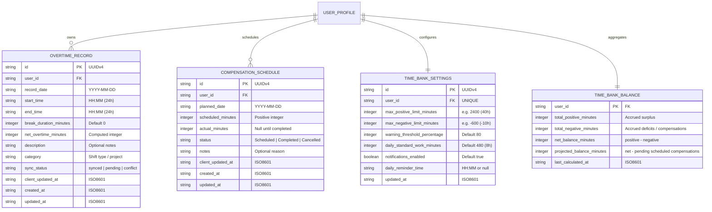
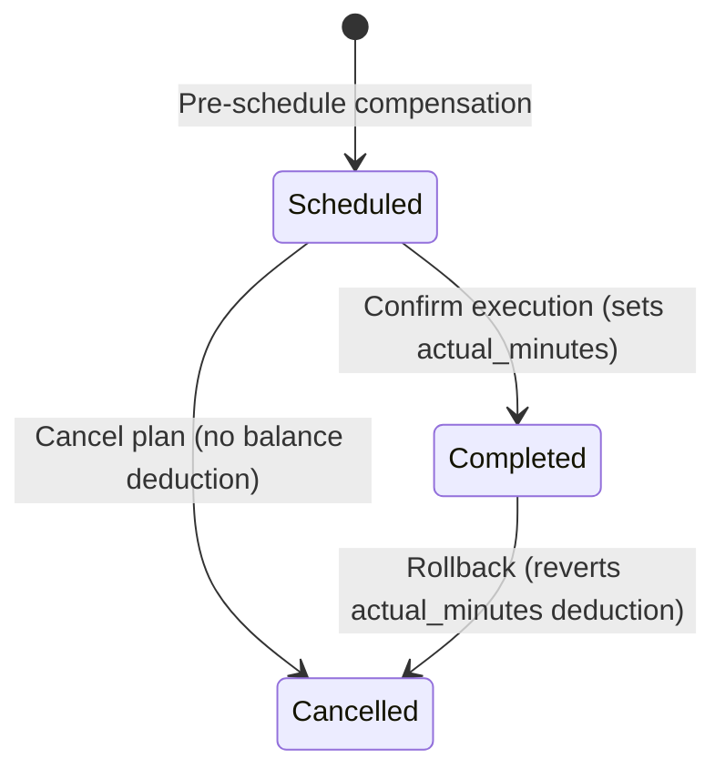

# Phase 1: Data Model & Schema Specification

**Feature**: Overtime Management & Time Bank System (`001-overtime-management`)  
**Date**: 2026-10-01  
**Storage**: SQLite 3 (Central Server) & IndexedDB via Dexie.js (Client-Side Local Storage)

---

## 1. Relational Entities (SQLite Server Schema)



---

## 2. Detailed Entity Definitions

### 2.1 OvertimeRecord (`overtime_records`)
Represents an individual logged overtime shift.

| Field | Type | Constraints | Description |
|-------|------|-------------|-------------|
| `id` | TEXT | PRIMARY KEY | Client-generated UUIDv4 |
| `user_id` | TEXT | NOT NULL | Identifier of the worker (default: `'default_user'`) |
| `record_date` | TEXT | NOT NULL | Date of the shift (`YYYY-MM-DD`) |
| `start_time` | TEXT | NOT NULL | Shift start time (`HH:MM`, 24h format) |
| `end_time` | TEXT | NOT NULL | Shift end time (`HH:MM`, 24h format) |
| `break_duration_minutes` | INTEGER | NOT NULL DEFAULT 0 | Unpaid break time deducted from duration |
| `net_overtime_minutes` | INTEGER | NOT NULL | Calculated net overtime duration in minutes |
| `description` | TEXT | NULL | Context or task notes |
| `category` | TEXT | NOT NULL DEFAULT 'standard' | Classification: `standard`, `weekend`, `holiday`, `night_shift` |
| `sync_status` | TEXT | NOT NULL DEFAULT 'synced' | `'synced'`, `'pending'`, `'conflict'` |
| `client_updated_at` | TEXT | NOT NULL | Client timestamp of last edit (`ISO8601`) |
| `created_at` | TEXT | NOT NULL | Creation timestamp (`ISO8601`) |
| `updated_at` | TEXT | NOT NULL | Server modification timestamp (`ISO8601`) |

#### Validation Rules & Midnight Handling
- `start_time` and `end_time` must match `^([01]\d|2[0-3]):[0-5]\d$`.
- **Duration Calculation**:
  - If `end_time > start_time`: `raw_minutes = (end_hour * 60 + end_min) - (start_hour * 60 + start_min)`.
  - If `end_time < start_time` (crossing midnight): `raw_minutes = ((end_hour + 24) * 60 + end_min) - (start_hour * 60 + start_min)`.
  - `net_overtime_minutes = raw_minutes - break_duration_minutes`.
  - `net_overtime_minutes` MUST be strictly greater than 0. If `break_duration_minutes >= raw_minutes`, validation fails.

---

### 2.2 CompensationSchedule (`compensation_schedules`)
Represents pre-planned or completed compensation time off.

| Field | Type | Constraints | Description |
|-------|------|-------------|-------------|
| `id` | TEXT | PRIMARY KEY | Client-generated UUIDv4 |
| `user_id` | TEXT | NOT NULL | Identifier of the worker |
| `planned_date` | TEXT | NOT NULL | Target date for compensation (`YYYY-MM-DD`) |
| `scheduled_minutes` | INTEGER | NOT NULL | Planned minutes to abate from bank (> 0) |
| `actual_minutes` | INTEGER | NULL | Actual minutes abated once completed |
| `status` | TEXT | NOT NULL DEFAULT 'Scheduled' | `'Scheduled'`, `'Completed'`, `'Cancelled'` |
| `notes` | TEXT | NULL | Reason or agreement note |
| `client_updated_at` | TEXT | NOT NULL | Client timestamp of last edit (`ISO8601`) |
| `created_at` | TEXT | NOT NULL | Creation timestamp (`ISO8601`) |
| `updated_at` | TEXT | NOT NULL | Server modification timestamp (`ISO8601`) |

#### State Transitions


---

### 2.3 TimeBankSettings (`time_bank_settings`)
Represents user preferences and safety boundaries.

| Field | Type | Constraints | Description |
|-------|------|-------------|-------------|
| `id` | TEXT | PRIMARY KEY | UUIDv4 |
| `user_id` | TEXT | NOT NULL UNIQUE | Identifier of the worker |
| `max_positive_limit_minutes`| INTEGER | NOT NULL DEFAULT 2400 | Max allowed surplus (+40h = 2400 min) |
| `max_negative_limit_minutes`| INTEGER | NOT NULL DEFAULT -600 | Max allowed deficit (-10h = -600 min) |
| `warning_threshold_percentage`| INTEGER | NOT NULL DEFAULT 80 | Percentage (e.g., 80) triggering alert |
| `daily_standard_work_minutes`| INTEGER | NOT NULL DEFAULT 480 | Default daily work journey (8h) |
| `notifications_enabled` | INTEGER | NOT NULL DEFAULT 1 | Boolean (1=true, 0=false) |
| `daily_reminder_time` | TEXT | NULL | Preferred time for daily check-in prompt |
| `updated_at` | TEXT | NOT NULL | Timestamp of last setting change |

---

### 2.4 TimeBankBalance (Aggregated View / Cache Table)
Maintains current real-time ledger balance.

| Field | Type | Constraints | Description |
|-------|------|-------------|-------------|
| `user_id` | TEXT | PRIMARY KEY | User reference |
| `total_positive_minutes` | INTEGER | NOT NULL DEFAULT 0 | Sum of `net_overtime_minutes` from active records |
| `total_negative_minutes` | INTEGER | NOT NULL DEFAULT 0 | Sum of `actual_minutes` from completed compensations |
| `net_balance_minutes` | INTEGER | NOT NULL DEFAULT 0 | `total_positive_minutes - total_negative_minutes` |
| `projected_balance_minutes` | INTEGER | NOT NULL DEFAULT 0 | `net_balance_minutes - sum(scheduled_minutes where status='Scheduled')` |
| `last_calculated_at` | TEXT | NOT NULL | Timestamp of last recalculation |

---

## 3. Client-Side Dexie.js Schema (IndexedDB)

```typescript
// Client-side Database Definition (src/services/db.ts)
import Dexie, { type Table } from 'dexie';

export interface LocalOvertimeRecord {
  id: string;
  userId: string;
  recordDate: string;
  startTime: string;
  endTime: string;
  breakDurationMinutes: number;
  netOvertimeMinutes: number;
  description?: string;
  category: string;
  syncStatus: 'synced' | 'pending' | 'conflict';
  clientUpdatedAt: string;
  createdAt: string;
  updatedAt: string;
}

export interface LocalCompensationSchedule {
  id: string;
  userId: string;
  plannedDate: string;
  scheduledMinutes: number;
  actualMinutes?: number;
  status: 'Scheduled' | 'Completed' | 'Cancelled';
  notes?: string;
  syncStatus: 'synced' | 'pending' | 'conflict';
  clientUpdatedAt: string;
  createdAt: string;
  updatedAt: string;
}

export interface LocalSyncQueueItem {
  id?: number;
  entityType: 'overtime_record' | 'compensation_schedule' | 'settings';
  entityId: string;
  action: 'insert' | 'update' | 'delete';
  payload: any;
  enqueuedAt: string;
}

export class MinhasHorasDB extends Dexie {
  overtimeRecords!: Table<LocalOvertimeRecord, string>;
  compensations!: Table<LocalCompensationSchedule, string>;
  syncQueue!: Table<LocalSyncQueueItem, number>;

  constructor() {
    super('minhashoras_db');
    this.version(1).stores({
      overtimeRecords: 'id, recordDate, syncStatus, clientUpdatedAt',
      compensations: 'id, plannedDate, status, syncStatus',
      syncQueue: '++id, entityType, entityId, enqueuedAt'
    });
  }
}
```

---

## 4. Conflict Resolution & Idempotency Rules

1. **Client ID Generation**: All IDs are UUIDv4 strings generated client-side upon creation. This eliminates primary key collisions across offline sessions.
2. **Deterministic Upsert**: During sync (`POST /api/v1/sync`), the server checks the incoming `client_updated_at`:
   - If the server has a record with identical `id`:
     - If incoming `client_updated_at >= existing.updated_at`, apply incoming values and set `updated_at = NOW()`.
     - If incoming `client_updated_at < existing.updated_at`, retain server record, mark response as `conflict_resolved_server_wins`, and return latest server record to overwrite client cache.
3. **Balance Recalculation**: Server recalculates `TimeBankBalance` inside the same database transaction after processing the batch.
