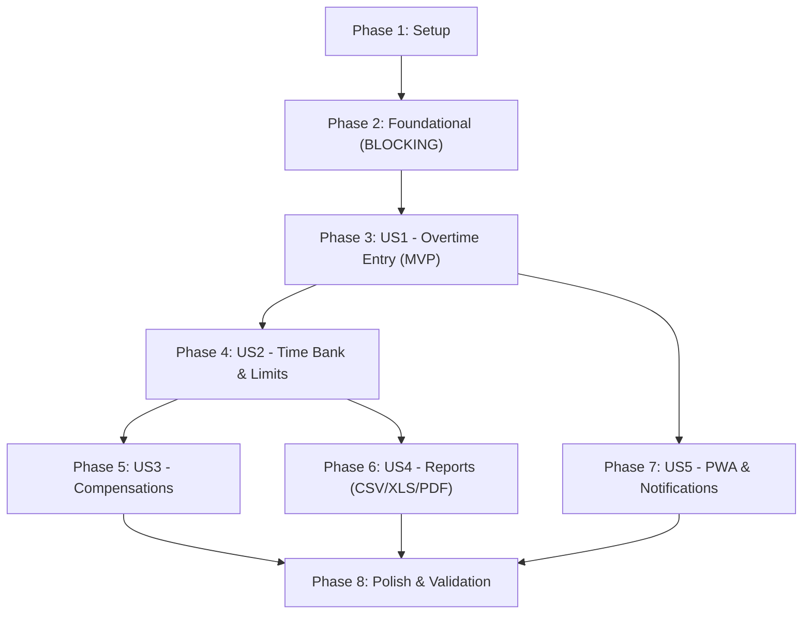

# Tasks: Overtime Management & Time Bank System

**Feature**: Overtime Management & Time Bank System (`001-overtime-management`)  
**Input**: Design artifacts from `specs/001-overtime-management/` (`spec.md`, `plan.md`, `data-model.md`, `contracts/api-spec.yaml`, `quickstart.md`)  
**Status**: Ready for Implementation  

---

## Phase 1: Setup (Shared Infrastructure)

**Purpose**: Project initialization, monorepo configuration, tooling, and containerization setup.

- [X] T001 Initialize monorepo directory layout with root `package.json`, TypeScript configurations (`tsconfig.json`, `server/tsconfig.json`, `client/tsconfig.json`), and build/dev scripts per `specs/001-overtime-management/plan.md`
- [X] T002 [P] Configure Tailwind CSS and PostCSS for mobile touch ergonomics with custom safe-area utilities in `client/tailwind.config.js` and `client/postcss.config.js`
- [X] T003 [P] Configure Vite with `vite-plugin-pwa` in `client/vite.config.ts` with PWA web manifest settings, caching strategies, and service worker registration
- [X] T004 [P] Setup Vitest configuration for server and client test execution in `vitest.config.ts`
- [X] T005 [P] Create multi-stage Alpine Dockerfile and Docker Compose configuration supporting `linux/arm64` and `linux/amd64` with persistent volume `/data` in `Dockerfile` and `docker-compose.yml`

---

## Phase 2: Foundational (Blocking Prerequisites)

**Purpose**: Core infrastructure and base persistence layers that MUST be complete before ANY user story can be implemented.

**⚠️ CRITICAL**: No user story work can begin until this phase is complete.

- [X] T006 Implement SQLite database connection using `better-sqlite3` with Write-Ahead Logging (`PRAGMA journal_mode = WAL;`) and `PRAGMA synchronous = NORMAL;` in `server/src/db/connection.ts`
- [X] T007 Implement automated database schema migration manager with initial table definitions (`overtime_records`, `compensation_schedules`, `time_bank_settings`, `time_bank_balance`) in `server/src/db/migrations/001_initial_schema.ts`
- [X] T008 [P] Initialize Fastify server instance with global error handler, JSON schema validator, CORS, and `@fastify/static` plugin in `server/src/index.ts`
- [X] T009 [P] Implement client-side Dexie.js database schema and stores (`overtimeRecords`, `compensations`, `syncQueue`) in `client/src/services/db.ts`
- [X] T010 [P] Implement mobile-first shell layout with app header, network connectivity indicator, and bottom navigation bar in `client/src/components/layout/AppLayout.vue`
- [X] T011 [P] Implement healthcheck route `GET /api/v1/health` verifying database connectivity in `server/src/routes/health.ts`

**Checkpoint**: Foundation ready - database migrations run, server boots, Dexie.js initializes, and mobile layout renders.

---

## Phase 3: User Story 1 - Offline-First Overtime Entry & Log Viewing (Priority: P1) 🎯 MVP

**Goal**: Enable workers to log overtime work shifts (start/end times, midnight rollover, break deduction) on mobile devices offline or online, store them locally in IndexedDB, and synchronize automatically with the central SQLite database.

**Independent Test**: Turn on Airplane Mode, enter an overtime record from 22:00 to 02:00 (crossing midnight) with 30m break, verify local display of 3h 30m (210m) with "Pendente" badge, restore connectivity, and verify automatic sync to "Sincronizado".

### Tests for User Story 1

- [X] T012 [P] [US1] Unit test for shift duration calculation and midnight rollover handling (`start_time`, `end_time` crossing midnight, subtracting `break_duration_minutes`, enforcing `net_overtime_minutes > 0`) in `server/tests/unit/time-calculator.test.ts`
- [X] T013 [P] [US1] Contract test for `GET /api/v1/records`, `POST /api/v1/records`, `PUT /api/v1/records/:id`, and `DELETE /api/v1/records/:id` in `server/tests/contract/records.test.ts`
- [X] T014 [P] [US1] Contract test for offline batch synchronization endpoint `POST /api/v1/sync` in `server/tests/contract/sync.test.ts`

### Implementation for User Story 1

- [X] T015 [US1] Implement shift interval and overtime calculation service with midnight rollover logic in `server/src/services/time-calculator.ts`
- [X] T016 [US1] Implement overtime records database repository with constraints (`id` UUIDv4 PK, `record_date` YYYY-MM-DD, `start_time` and `end_time` matching `^([01]\d|2[0-3]):[0-5]\d$`, `break_duration_minutes` integer >= 0, `net_overtime_minutes` > 0, `sync_status` enum 'synced'|'pending'|'conflict') in `server/src/repositories/records-repository.ts`
- [X] T017 [US1] Implement REST API endpoints for records (`GET /api/v1/records`, `POST /api/v1/records`, `PUT /api/v1/records/:id`, `DELETE /api/v1/records/:id`) in `server/src/routes/records.ts`
- [X] T018 [US1] Implement batch synchronization service and endpoint `POST /api/v1/sync` handling idempotent upserts, server timestamping, and conflict resolution in `server/src/services/sync-service.ts` and `server/src/routes/sync.ts`
- [X] T019 [P] [US1] Implement client-side offline queue and synchronization manager with online/offline listeners in `client/src/services/sync.ts`
- [X] T020 [P] [US1] Implement mobile overtime record form modal with start/end time pickers, break input, and instant validation in `client/src/components/records/OvertimeFormModal.vue`
- [X] T021 [P] [US1] Implement mobile overtime record card and timeline list with sync status badges ('synced' | 'pending' | 'conflict') in `client/src/components/records/RecordCard.vue` and `client/src/components/records/RecordList.vue`
- [X] T022 [US1] Implement daily/monthly records view with date grouping and local Dexie.js integration in `client/src/views/RecordsView.vue`

**Checkpoint**: User Story 1 (MVP) is fully functional and independently testable both offline and online.

---

## Phase 4: User Story 2 - Time Bank Balance & Limit Configuration (Priority: P2)

**Goal**: Aggregate accrued positive and negative time bank balances, support user configuration of safety limits (e.g. max +40h, max -10h), and display visual warning banners when approaching (80%) or exceeding (100%) thresholds.

**Independent Test**: Configure a maximum positive limit of +10 hours and 80% warning threshold, log shifts totaling 8.5 hours to verify the amber warning banner, then log shifts totaling 10.5 hours to verify the critical limit exceeded alert.

### Tests for User Story 2

- [X] T023 [P] [US2] Unit test for balance calculation (positive accrued overtime minus negative compensations) and threshold alerts (80% warning, 100% exceeded) in `server/tests/unit/balance-calculator.test.ts`
- [X] T024 [P] [US2] Contract test for `GET /api/v1/balance`, `GET /api/v1/settings`, and `PUT /api/v1/settings` in `server/tests/contract/balance-settings.test.ts`

### Implementation for User Story 2

- [X] T025 [US2] Implement time bank balance calculator service updating `TimeBankBalance` table on server in `server/src/services/balance-calculator.ts`
- [X] T026 [US2] Implement REST API routes `GET /api/v1/balance`, `GET /api/v1/settings`, and `PUT /api/v1/settings` with validation constraints (`max_positive_limit_minutes` integer default 2400, `max_negative_limit_minutes` integer default -600, `warning_threshold_percentage` integer default 80) in `server/src/routes/balance.ts` and `server/src/routes/settings.ts`
- [X] T027 [P] [US2] Implement client-side balance calculation service for offline ledger updates in `client/src/services/balance-service.ts`
- [X] T028 [P] [US2] Implement balance card and threshold alert banners (warning at 80%, critical alert at 100%) in `client/src/components/balance/BalanceCard.vue` and `client/src/components/balance/LimitAlertBanner.vue`
- [X] T029 [P] [US2] Implement time bank limit configuration view with inputs for positive and negative ceilings in `client/src/views/SettingsView.vue`
- [X] T030 [US2] Integrate balance summary card and alert banners into main dashboard view in `client/src/views/DashboardView.vue`

**Checkpoint**: User Stories 1 and 2 work seamlessly together, providing full visibility and limit protection.

---

## Phase 5: User Story 3 - Pre-Scheduling Compensation (Priority: P3)

**Goal**: Allow workers to pre-schedule future time off or shortened shifts to compensate accumulated positive balance, displaying both current realized balance and projected balance.

**Independent Test**: Pre-schedule 4 hours of compensation for a future date, verify projected balance decreases by 4 hours while realized balance stays unchanged, then mark compensation as completed and verify realized balance updates.

### Tests for User Story 3

- [X] T031 [P] [US3] Unit test for projected balance calculations (`net_balance_minutes` minus sum of `scheduled_minutes` where `status='Scheduled'`) in `server/tests/unit/compensation-calculator.test.ts`
- [X] T032 [P] [US3] Contract test for `GET`, `POST`, `PUT /api/v1/compensations` in `server/tests/contract/compensations.test.ts`

### Implementation for User Story 3

- [X] T033 [US3] Implement compensation repository with constraints (`id` UUIDv4 PK, `planned_date` YYYY-MM-DD, `scheduled_minutes` integer > 0, `status` enum 'Scheduled'|'Completed'|'Cancelled', `actual_minutes` nullable integer) in `server/src/repositories/compensations-repository.ts`
- [X] T034 [US3] Implement REST API endpoints `GET`, `POST`, `PUT /api/v1/compensations` and integrate with batch sync in `server/src/routes/compensations.ts`
- [X] T035 [P] [US3] Implement compensation pre-scheduling modal with date picker, duration in hours/minutes, and projected balance preview in `client/src/components/compensations/CompensationModal.vue`
- [X] T036 [P] [US3] Implement compensation schedule list with actions to confirm completion, adjust actual minutes, or cancel in `client/src/components/compensations/ScheduleList.vue`
- [X] T037 [US3] Implement dedicated compensations management view and agenda in `client/src/views/CompensationsView.vue`

**Checkpoint**: User Stories 1, 2, and 3 provide an end-to-end overtime tracking and compensation loop.

---

## Phase 6: User Story 4 - Multi-Format Report Export (CSV, XLS, PDF) (Priority: P4)

**Goal**: Generate and export comprehensive time bank and shift reports in CSV, Excel (.xlsx), and PDF formats for any user-selected date range.

**Independent Test**: Select current month, export CSV, XLSX, and PDF files, and verify that each file downloads in <2 seconds with correct itemized entries and matching totals.

### Tests for User Story 4

- [X] T038 [P] [US4] Contract test for report export endpoint `GET /api/v1/reports/export` with query parameters `format` ('csv'|'xlsx'|'pdf'), `start_date`, and `end_date` in `server/tests/contract/reports.test.ts`

### Implementation for User Story 4

- [X] T039 [US4] Implement CSV report streaming generator complying with RFC 4180 in `server/src/services/reports/csv-generator.ts`
- [X] T040 [US4] Implement Excel `.xlsx` generator using ExcelJS with formatted headers, styles, and sum formulas in `server/src/services/reports/excel-generator.ts`
- [X] T041 [US4] Implement PDF report generator using PDFKit with summary header (period, total positive, total negative, net balance) and itemized table in `server/src/services/reports/pdf-generator.ts`
- [X] T042 [US4] Implement report export route `GET /api/v1/reports/export` in `server/src/routes/reports.ts`
- [X] T043 [P] [US4] Implement client-side offline fallback report generation using jsPDF and native CSV blob download from local Dexie.js cache in `client/src/services/client-report-generator.ts`
- [X] T044 [US4] Implement reports view with period selector (current month, previous month, custom date range) and download trigger buttons in `client/src/views/ReportsView.vue`

**Checkpoint**: Reports can be generated both online from server and offline from local cache in all three formats.

---

## Phase 7: User Story 5 - Mobile PWA Installation & Proactive Notifications (Priority: P5)

**Goal**: Enable home-screen installation on Android and iOS devices, and deliver proactive notifications for threshold limit warnings, scheduled compensations, and daily entry reminders.

**Independent Test**: Open web application on mobile device, verify PWA install prompt / iOS instructions, install to home screen, open standalone app, trigger a limit warning, and verify Web Notification alert.

### Implementation for User Story 5

- [X] T045 [P] [US5] Implement Web App Manifest and PWA touch icons (192x192, 512x512, apple-touch-icon) in `client/public/manifest.webmanifest` and `client/public/icons/`
- [X] T046 [P] [US5] Implement PWA installation banner and iOS Safari add-to-home-screen instructions modal in `client/src/components/layout/InstallPromptModal.vue`
- [X] T047 [P] [US5] Implement notification service using Web Notifications API with permission request and local alerts for threshold warnings and compensation reminders in `client/src/services/notifications.ts`
- [X] T048 [US5] Implement service worker background sync registration and push notification event handlers in `client/src/sw.ts`
- [X] T049 [US5] Integrate notification preferences toggle and reminder time picker into `client/src/views/SettingsView.vue`

**Checkpoint**: Full PWA experience with native-like mobile installability and notifications.

---

## Phase 8: Polish & Cross-Cutting Concerns

**Purpose**: Multi-architecture validation, memory footprint verification, UX ergonomics polish, and documentation.

- [X] T050 [P] End-to-end quickstart validation scenario execution per `specs/001-overtime-management/quickstart.md` in `tests/e2e/quickstart-validation.test.ts`
- [X] T051 [P] Verify ARM64 multi-arch build and memory footprint verification script (<60MB RSS) in `scripts/verify-footprint.sh`
- [X] T052 Verify dark/light mobile theme contrast, safe area insets (`env(safe-area-inset-bottom)`), and minimum 44x44px touch targets across all views in `client/src/App.vue`
- [X] T053 Create project README with Raspberry Pi deployment instructions via Docker Compose in `README.md`

---

## Dependencies & Execution Order

### Phase Dependencies



### User Story Dependencies

- **US1 (P1)**: Starts immediately after Foundational (Phase 2). No dependencies on other stories. Delivers the standalone MVP.
- **US2 (P2)**: Builds upon US1 record entries to aggregate positive/negative balances and configure thresholds.
- **US3 (P3)**: Extends US2 by scheduling compensation deductions from the positive balance.
- **US4 (P4)**: Consumes records (US1) and balances (US2) to generate CSV, XLS, and PDF exports.
- **US5 (P5)**: Enhances mobile presentation, install prompts, and notification triggers for US2/US3.

---

## Parallel Execution Opportunities

### Setup Phase Parallelism
```bash
# Launch in parallel:
Task T002: Tailwind CSS & PostCSS config in client/tailwind.config.js
Task T003: Vite PWA config in client/vite.config.ts
Task T004: Vitest config in vitest.config.ts
Task T005: Alpine Dockerfile & Docker Compose in Dockerfile & docker-compose.yml
```

### Foundational Phase Parallelism
```bash
# Launch in parallel (once database connection T006 and schema T007 complete):
Task T008: Fastify server initialization in server/src/index.ts
Task T009: Client-side Dexie.js database schema in client/src/services/db.ts
Task T010: Mobile layout shell in client/src/components/layout/AppLayout.vue
Task T011: Healthcheck endpoint in server/src/routes/health.ts
```

### User Story 1 Parallelism
```bash
# Launch tests first in parallel:
Task T012: Unit test in server/tests/unit/time-calculator.test.ts
Task T013: Contract test in server/tests/contract/records.test.ts
Task T014: Sync contract test in server/tests/contract/sync.test.ts

# Launch client components in parallel:
Task T019: Client sync service in client/src/services/sync.ts
Task T020: Form modal in client/src/components/records/OvertimeFormModal.vue
Task T021: Record card & list in client/src/components/records/RecordCard.vue
```

---

## Implementation Strategy

### MVP Scope (User Story 1 Only)
1. Complete **Phase 1: Setup** (T001–T005)
2. Complete **Phase 2: Foundational** (T006–T011)
3. Complete **Phase 3: User Story 1** (T012–T022)
4. **VALIDATE MVP**: Run Scenario 1, 2, and 3 from `quickstart.md` (mobile overtime recording, midnight handling, offline entry, and auto-sync). The user now has a working offline-first overtime logger!

### Incremental Feature Expansion
- **Increment 2**: Add User Story 2 (T023–T030) → Unlocks balance calculations and limit threshold alerts.
- **Increment 3**: Add User Story 3 (T031–T037) → Unlocks compensation pre-scheduling and projected balance.
- **Increment 4**: Add User Story 4 (T038–T044) → Unlocks CSV, Excel, and PDF reporting.
- **Increment 5**: Add User Story 5 (T045–T049) → Unlocks home screen PWA installation and notifications.
- **Increment 6**: Polish & Validation (T050–T053) → Verifies container memory (<60MB RSS) on Raspberry Pi.
