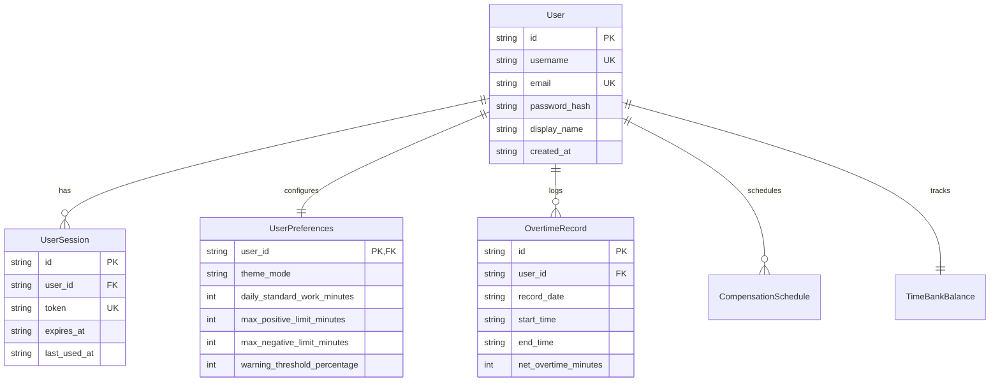

# Data Model: Authentication, Multi-User Support & Impeccable Theming

**Feature Branch**: `002-auth-multiuser-theme`
**Date**: 2026-10-01

## 1. Entities & Schemas

### Entity 1: User (`users`)
Represents an individual worker or user account on the system.

| Field | Type | Constraints | Description |
| :--- | :--- | :--- | :--- |
| `id` | TEXT (UUID) | PRIMARY KEY | Unique identifier for the user. |
| `username` | TEXT | UNIQUE, NOT NULL | Alphanumeric login identifier (3-32 chars, lowercase). |
| `email` | TEXT | UNIQUE, NOT NULL | Valid email address for notifications and identification. |
| `password_hash` | TEXT | NOT NULL | Salted cryptographic hash (scrypt) with embedded salt. |
| `display_name` | TEXT | NOT NULL | User's preferred display name for UI headers/avatars. |
| `created_at` | TEXT (ISO 8601) | NOT NULL | Timestamp when account was created. |
| `updated_at` | TEXT (ISO 8601) | NOT NULL | Timestamp when account was last updated. |

**Validation Rules**:
- `username`: Regex `^[a-zA-Z0-9._-]{3,32}$`. Cannot be changed to match an existing user.
- `email`: Valid RFC 5322 format. Normalized to lowercase.
- `password` (pre-hash): Minimum 8 characters; must contain at least 1 letter and 1 number.

---

### Entity 2: User Session (`user_sessions`)
Represents an active authenticated bearer session issued to a user.

| Field | Type | Constraints | Description |
| :--- | :--- | :--- | :--- |
| `id` | TEXT (UUID) | PRIMARY KEY | Unique session identifier. |
| `user_id` | TEXT | NOT NULL, REFERENCES `users(id)` ON DELETE CASCADE | Associated user ID. |
| `token` | TEXT | UNIQUE, NOT NULL | 256-bit cryptographically secure random bearer token (hex or base64url). |
| `user_agent` | TEXT | NULLABLE | Client browser/device user agent metadata. |
| `ip_address` | TEXT | NULLABLE | Remote client IP address for audit logging. |
| `expires_at` | TEXT (ISO 8601) | NOT NULL | Expiry date/time (default: 30 days rolling). |
| `created_at` | TEXT (ISO 8601) | NOT NULL | When session was created. |
| `last_used_at`| TEXT (ISO 8601) | NOT NULL | Timestamp of last authenticated API invocation. |

**State Transitions**:
- Active -> Expired: Triggered when `current_time > expires_at`.
- Active -> Revoked/Deleted: Triggered when user explicitly calls `/api/auth/logout` or changes password.

---

### Entity 3: User Preferences (`user_preferences`)
Stores personalized visual, theme, and time bank configuration preferences for each user.

| Field | Type | Constraints | Description |
| :--- | :--- | :--- | :--- |
| `user_id` | TEXT | PRIMARY KEY, REFERENCES `users(id)` ON DELETE CASCADE | User ID owning the preferences. |
| `theme_mode` | TEXT | NOT NULL DEFAULT `'system'` | `'light'` \| `'dark'` \| `'system'` |
| `daily_standard_work_minutes` | INTEGER | NOT NULL DEFAULT 480 | Daily work shift target (e.g. 8h = 480m). |
| `max_positive_limit_minutes` | INTEGER | NOT NULL DEFAULT 2400 | Maximum positive time bank limit (e.g. +40h). |
| `max_negative_limit_minutes` | INTEGER | NOT NULL DEFAULT -600 | Maximum negative time bank limit (e.g. -10h). |
| `warning_threshold_percentage` | INTEGER | NOT NULL DEFAULT 80 | Percentage of limit at which to alert user. |
| `updated_at` | TEXT (ISO 8601) | NOT NULL | Timestamp of last preference update. |

---

### Entity 4: User-Scoped Overtime Record (`overtime_records`)
Existing table updated to enforce foreign key ownership.

| Field | Type | Constraints | Description |
| :--- | :--- | :--- | :--- |
| `id` | TEXT (UUID) | PRIMARY KEY | Record identifier. |
| `user_id` | TEXT | NOT NULL, REFERENCES `users(id)` | User owning this record. Indexed with `record_date`. |
| `record_date` | TEXT | NOT NULL | ISO date `YYYY-MM-DD`. |
| `start_time` | TEXT | NOT NULL | `HH:mm` format. |
| `end_time` | TEXT | NOT NULL | `HH:mm` format. |
| `break_duration_minutes` | INTEGER | NOT NULL DEFAULT 0 | Break time deducted. |
| `net_overtime_minutes` | INTEGER | NOT NULL | Net extra minutes logged. |
| `description` | TEXT | NULLABLE | Shift notes or task description. |
| `category` | TEXT | NOT NULL DEFAULT `'standard'` | Shift category. |
| `sync_status` | TEXT | NOT NULL DEFAULT `'synced'` | Sync state (`'synced'`, `'pending'`, `'conflict'`). |
| `client_updated_at` | TEXT | NOT NULL | Timestamp from client clock for conflict resolution. |
| `created_at` | TEXT | NOT NULL | Record creation timestamp. |
| `updated_at` | TEXT | NOT NULL | Record update timestamp. |

---

## 2. Client IndexedDB (Dexie v2 Schema)

```typescript
// Upgraded schema in client/src/services/db.ts
this.version(2).stores({
  overtimeRecords: 'id, user_id, record_date, sync_status, client_updated_at',
  compensations: 'id, user_id, planned_date, status, sync_status',
  syncQueue: '++id, user_id, entityType, entityId, enqueuedAt',
  preferences: 'user_id, theme_mode',
  activeSession: 'id, user_id'
});
```

---

## 3. Relationships & Cardinality


