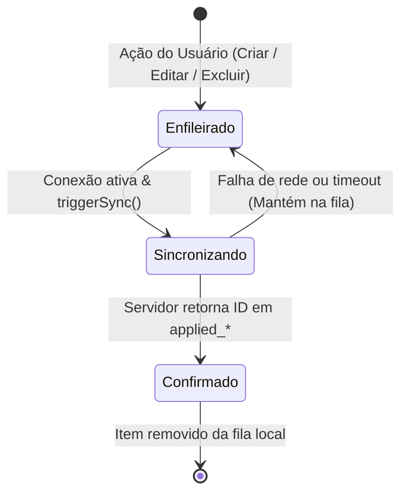

# Data Model: Sincronização Confiável e Status Online/Offline

**Feature Branch**: `004-fix-sync-and-status`
**Date**: 2026-10-02
**Spec**: [spec.md](./spec.md)

## Entidades e Estrutura de Dados

### 1. Fila de Sincronização Local (`LocalSyncQueueItem`)
Armazenada no IndexedDB cliente (tabela `syncQueue`) para registrar mutações que necessitam de envio ao servidor central.

| Campo | Tipo | Nulo | Descrição |
| :--- | :--- | :---: | :--- |
| `id` | Integer (Auto) | Não | Chave primária da tabela Dexie. |
| `user_id` | String | Não | Identificador do usuário proprietário da mutação. |
| `entityType` | Enum | Não | Tipo da entidade: `'overtime_record'` ou `'compensation_schedule'`. |
| `entityId` | String (UUID) | Não | Identificador único do registro alterado ou excluído. |
| `action` | Enum | Não | Operação a executar: `'insert'`, `'update'`, ou `'delete'`. |
| `payload` | Object / JSON | Sim | Dados da entidade (para `'insert'` e `'update'`) ou `{ id }` (para `'delete'`). |
| `enqueuedAt` | String (ISO 8601) | Não | Carimbo do momento em que a mutação foi efetuada no cliente. |

#### Ciclo de Vida e Transições de Estado

---

### 2. Registro de Hora Extra (`LocalOvertimeRecord` & `OvertimeRecordEntity`)
Representa a jornada extra de trabalho. Armazenado localmente em `localDb.overtimeRecords` e no servidor em SQLite (`overtime_records`).

| Campo | Tipo | Descrição |
| :--- | :--- | :--- |
| `id` | String (UUID) | Identificador único imutável preservado entre cliente e servidor. |
| `user_id` | String | Chave de particionamento e isolamento do usuário. |
| `record_date` | String (`YYYY-MM-DD`) | Data do turno extra. |
| `start_time` | String (`HH:mm`) | Horário de início do turno. |
| `end_time` | String (`HH:mm`) | Horário de término do turno (suporta transição de meia-noite). |
| `break_duration_minutes` | Integer | Minutos de pausa/refeição deduzidos. |
| `net_overtime_minutes` | Integer | Minutos líquidos excedentes calculados. |
| `description` | String (Opcional) | Justificativa ou detalhamento da atividade. |
| `category` | String | Classificação (ex: `'standard'`, `'weekend'`, `'holiday'`). |
| `sync_status` | Enum (`'synced'`, `'pending'`, `'conflict'`) | Status de consistência com o servidor central. |
| `client_updated_at` | String (ISO 8601) | Carimbo do cliente da última edição intencional (base para LWW). |
| `created_at` | String (ISO 8601) | Data/hora de criação original (imutável em edições). |
| `updated_at` | String (ISO 8601) | Carimbo de gravação física no banco SQLite. |

#### Regras de Atualização e Exclusão
- **Criação**: `sync_status = 'pending'`, `client_updated_at = now`, `created_at = now`.
- **Edição**: Preserva `created_at` original; atualiza `client_updated_at = now`, `sync_status = 'pending'`, enfileira ação `'update'`.
- **Exclusão**: Remove de `localDb.overtimeRecords`; enfileira ação `'delete'` com `{ id }` em `syncQueue`.

---

### 3. Agendamento de Compensação (`LocalCompensationSchedule` & `CompensationEntity`)
Armazenado em `localDb.compensations` e no SQLite `compensation_schedules`.

| Campo | Tipo | Descrição |
| :--- | :--- | :--- |
| `id` | String (UUID) | Identificador único imutável. |
| `user_id` | String | Identificador do usuário autenticado. |
| `planned_date` | String (`YYYY-MM-DD`) | Data planejada para compensação. |
| `scheduled_minutes` | Integer | Minutos planejados para compensar (> 0). |
| `actual_minutes` | Integer (Opcional) | Minutos efetivamente realizados. |
| `status` | Enum | `'Scheduled'`, `'Completed'`, `'Cancelled'`. |
| `notes` | String (Opcional) | Observações adicionais. |
| `sync_status` | Enum (`'synced'`, `'pending'`, `'conflict'`) | Status de sincronização. |
| `client_updated_at` | String (ISO 8601) | Carimbo da alteração no cliente. |
| `created_at` | String (ISO 8601) | Data/hora de criação original. |
| `updated_at` | String (ISO 8601) | Data/hora de gravação no servidor. |

---

### 4. Estado Reativo de Rede e Sincronização (`NetworkSyncState`)
Objeto reativo mantido em memória no frontend via `useNetworkStatus()`.

| Propriedade | Tipo | Descrição |
| :--- | :--- | :--- |
| `isOnline` | `Ref<boolean>` | `true` se `navigator.onLine` e eventos de rede indicam conectividade. |
| `isSyncing` | `Ref<boolean>` | `true` enquanto uma requisição de `/api/v1/sync` ou pull estiver ativa. |
| `pendingCount` | `Ref<number>` | Quantidade total de mutações pendentes (inserções, edições e exclusões). |
| `lastSyncAt` | `Ref<Date | null>` | Data/hora do último ciclo de sincronização bem-sucedido. |
