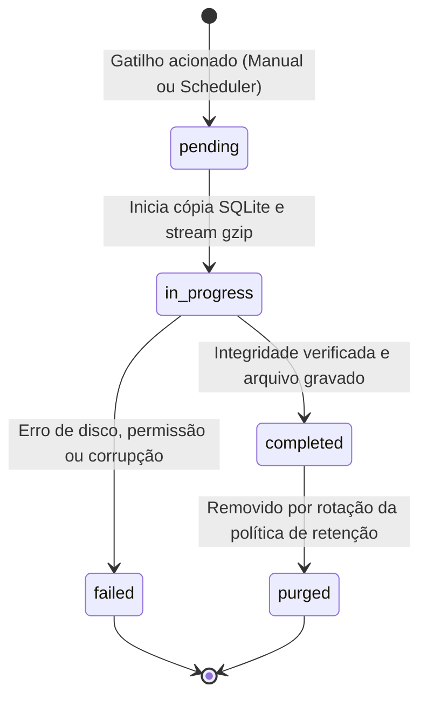

# Data Model: Mecanismo de Backup Externo e Rotinas Programáveis

**Feature**: `005-external-data-backup`  
**Date**: 2026-10-02  
**Status**: Completed  

---

## 1. Visão Geral das Entidades

O modelo de dados introduz duas novas tabelas relacionais no banco de dados SQLite do servidor para gerenciar as rotinas de agendamento e o histórico de execuções de backup:

1. **`backup_schedules`**: Armazena as configurações e o estado da rotina programável de backup automático.
2. **`backup_runs`**: Registra cada evento de execução (automática ou manual), seus metadados de integridade, status e localização física do artefato gerado.

---

## 2. Esquema Relacional (DDL)

```sql
-- Configuração da rotina automática de exportação/backup
CREATE TABLE IF NOT EXISTS backup_schedules (
  id TEXT PRIMARY KEY,                       -- UUID v4 ou identificador fixo (ex: 'default')
  enabled INTEGER NOT NULL DEFAULT 0,        -- 0 = Desativado, 1 = Ativo
  frequency TEXT NOT NULL DEFAULT 'daily',   -- 'daily' | 'weekly' | 'monthly'
  time_of_day TEXT NOT NULL DEFAULT '02:00', -- Formato 'HH:MM' (24h, fuso local do servidor)
  day_of_week INTEGER DEFAULT 0,             -- 0 (Domingo) a 6 (Sábado) - usado se frequency = 'weekly'
  day_of_month INTEGER DEFAULT 1,            -- 1 a 31 - usado se frequency = 'monthly'
  retention_count INTEGER NOT NULL DEFAULT 7,-- Quantidade máxima de backups preservados (mínimo 1, máximo 100)
  target_directory TEXT,                     -- Caminho customizado opcional (se nulo, usa BACKUP_DIR padrão)
  last_run_at TEXT,                          -- Timestamp ISO 8601 da última execução realizada
  next_run_at TEXT,                          -- Timestamp ISO 8601 do próximo disparo previsto
  created_at TEXT NOT NULL DEFAULT (datetime('now')),
  updated_at TEXT NOT NULL DEFAULT (datetime('now'))
);

-- Histórico de execuções e artefatos de backup gerados
CREATE TABLE IF NOT EXISTS backup_runs (
  id TEXT PRIMARY KEY,                       -- UUID v4
  schedule_id TEXT,                          -- FK opcional para backup_schedules (nulo se manual)
  trigger_type TEXT NOT NULL,                -- 'automated' | 'manual'
  status TEXT NOT NULL DEFAULT 'pending',    -- 'pending' | 'in_progress' | 'completed' | 'failed' | 'purged'
  file_name TEXT,                            -- Nome do arquivo gerado (ex: 'minhashoras-backup-20261002-020000.sqlite.gz')
  file_path TEXT,                            -- Caminho absoluto do arquivo no disco do servidor
  file_size_bytes INTEGER,                   -- Tamanho do arquivo em bytes
  checksum_sha256 TEXT,                      -- Hash SHA-256 do arquivo para validação de integridade
  records_count INTEGER,                     -- Quantidade aproximada de registros no snapshot
  error_message TEXT,                        -- Mensagem detalhada em caso de falha
  started_at TEXT NOT NULL,                  -- Timestamp ISO 8601 de início
  completed_at TEXT,                         -- Timestamp ISO 8601 de conclusão
  created_at TEXT NOT NULL DEFAULT (datetime('now')),
  FOREIGN KEY (schedule_id) REFERENCES backup_schedules(id) ON DELETE SET NULL
);

CREATE INDEX IF NOT EXISTS idx_backup_runs_status ON backup_runs(status);
CREATE INDEX IF NOT EXISTS idx_backup_runs_started_at ON backup_runs(started_at DESC);
```

---

## 3. Descrição Detalhada das Entidades

### 3.1 `backup_schedules`

Representa a configuração da rotina periódica do sistema.

| Campo | Tipo | Nulo? | Padrão | Regras de Validação |
|---|---|---|---|---|
| `id` | `TEXT` | Não | - | Identificador único da rotina |
| `enabled` | `INTEGER` | Não | `0` | Valor booleano (`0` ou `1`) |
| `frequency` | `TEXT` | Não | `'daily'` | Valores aceitos: `'daily'`, `'weekly'`, `'monthly'` |
| `time_of_day` | `TEXT` | Não | `'02:00'` | Regex `^([01]\d\|2[0-3]):[0-5]\d$` |
| `day_of_week` | `INTEGER` | Sim | `0` | Intervalo `0` a `6` (0 = Domingo) |
| `day_of_month` | `INTEGER` | Sim | `1` | Intervalo `1` a `31` |
| `retention_count` | `INTEGER` | Não | `7` | Inteiro `>= 1` e `<= 100` |
| `target_directory` | `TEXT` | Sim | `NULL` | Caminho de diretório validado no filesystem |
| `last_run_at` | `TEXT` | Sim | `NULL` | Data ISO 8601 |
| `next_run_at` | `TEXT` | Sim | `NULL` | Data ISO 8601 |
| `created_at` | `TEXT` | Não | `datetime('now')` | Data ISO 8601 |
| `updated_at` | `TEXT` | Não | `datetime('now')` | Data ISO 8601 |

### 3.2 `backup_runs`

Representa cada ciclo de execução e os artefatos resultantes.

| Campo | Tipo | Nulo? | Padrão | Regras de Validação |
|---|---|---|---|---|
| `id` | `TEXT` | Não | - | UUID v4 gerado no início da execução |
| `schedule_id` | `TEXT` | Sim | `NULL` | Referência à rotina geradora ou nulo para manual |
| `trigger_type` | `TEXT` | Não | - | `'automated'` ou `'manual'` |
| `status` | `TEXT` | Não | `'pending'` | `'pending'`, `'in_progress'`, `'completed'`, `'failed'`, `'purged'` |
| `file_name` | `TEXT` | Sim | `NULL` | Nome do arquivo final gerado |
| `file_path` | `TEXT` | Sim | `NULL` | Caminho físico acessível no host/volume |
| `file_size_bytes` | `INTEGER` | Sim | `NULL` | Tamanho positivo em bytes |
| `checksum_sha256` | `TEXT` | Sim | `NULL` | Hash SHA-256 de 64 caracteres hexadecimais |
| `records_count` | `INTEGER` | Sim | `NULL` | Total de registros incluídos |
| `error_message` | `TEXT` | Sim | `NULL` | Detalhe textual do erro caso status = `'failed'` |
| `started_at` | `TEXT` | Não | - | Data ISO 8601 de início da execução |
| `completed_at` | `TEXT` | Sim | `NULL` | Data ISO 8601 de encerramento |

---

## 4. Transições de Estado de `backup_runs`



### Regras de Negócio nas Transições:
1. **Bloqueio de Concorrência**: Não pode haver duas instâncias de `backup_runs` em estado `pending` ou `in_progress` simultaneamente. Novas requisições são rejeitadas com código HTTP 409 Conflict.
2. **Atomicidade da Retenção**: A transição para `purged` (e deleção do arquivo físico no disco externo) só é realizada após o novo registro de backup atingir o estado `completed`.
3. **Resiliência a Falhas**: Em caso de transição para `failed`, arquivos intermediários temporários são removidos imediatamente para não consumir espaço em disco.
