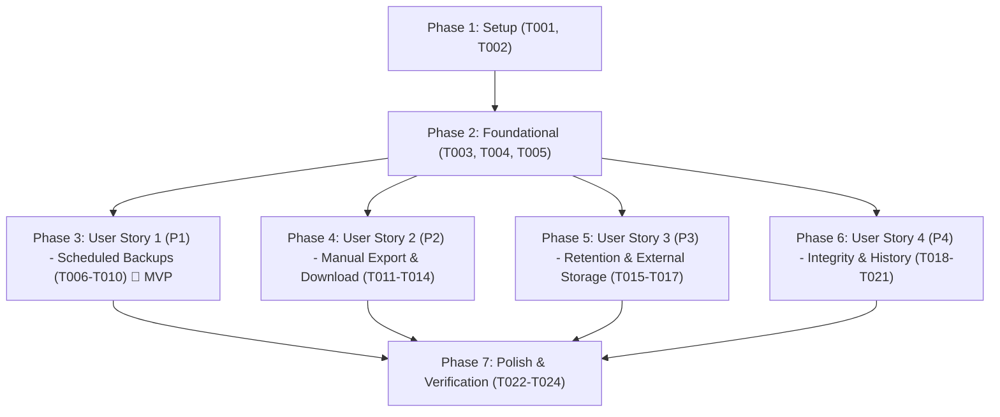

# Tasks: Mecanismo de Backup Externo e Rotinas Programáveis

**Feature**: `005-external-data-backup`  
**Input**: Design documents from `specs/005-external-data-backup/` (`spec.md`, `plan.md`, `data-model.md`, `contracts/`, `quickstart.md`)  
**Status**: Ready for Implementation  

---

## Phase 1: Setup (Shared Infrastructure)

**Purpose**: Project initialization and backup filesystem/volume configuration

- [X] T001 Configure external backup volume `minhashoras-backups:/backups` and `BACKUP_DIR` environment variable in `docker-compose.yml`
- [X] T002 [P] Define TypeScript interfaces and schemas for `BackupSchedule`, `BackupRun`, `BackupStatus`, and API DTOs in `server/src/types/backup.ts`

---

## Phase 2: Foundational (Blocking Prerequisites)

**Purpose**: Database schema, repository access, and core backup compression engine that MUST be complete before ANY user story can be implemented

**⚠️ CRITICAL**: No user story work can begin until this phase is complete

- [X] T003 Create database migration `server/src/db/migrations/003_backup_system.ts` defining `backup_schedules` (id TEXT PRIMARY KEY, enabled INTEGER NOT NULL DEFAULT 0, frequency TEXT NOT NULL DEFAULT 'daily', time_of_day TEXT NOT NULL DEFAULT '02:00' with format `^([01]\d|2[0-3]):[0-5]\d$`, day_of_week INTEGER DEFAULT 0 [0-6], day_of_month INTEGER DEFAULT 1 [1-31], retention_count INTEGER NOT NULL DEFAULT 7 [1-100], target_directory TEXT, last_run_at TEXT, next_run_at TEXT, created_at, updated_at) and `backup_runs` (id TEXT PRIMARY KEY, schedule_id TEXT FK, trigger_type TEXT NOT NULL ['automated'|'manual'], status TEXT NOT NULL DEFAULT 'pending' ['pending'|'in_progress'|'completed'|'failed'|'purged'], file_name TEXT, file_path TEXT, file_size_bytes INTEGER, checksum_sha256 TEXT, records_count INTEGER, error_message TEXT, started_at TEXT NOT NULL, completed_at TEXT, created_at)
- [X] T004 Implement repository queries and mutations in `server/src/repositories/backup-repository.ts` for schedule retrieval, schedule updates, run creation, status updates, run history listing, and retention candidate selection
- [X] T005 [P] Implement core SQLite snapshot and compression engine in `server/src/services/backup-service.ts` using `better-sqlite3` `db.backup()`, streaming with `node:zlib.createGzip()`, and SHA-256 calculation with `node:crypto`

**Checkpoint**: Foundation ready - user story implementation can now begin in priority order

---

## Phase 3: User Story 1 - Agendamento e Execução Automática de Exportação/Backup (Priority: P1) 🎯 MVP

**Goal**: Permitir ao usuário ou administrador configurar rotinas de backup automáticas (frequência diária, semanal ou mensal e horário definido) que executem de forma autônoma e não bloqueante em segundo plano.

**Independent Test**: Configurar uma rotina automática com periodicidade e horário no banco, acionar a checagem do temporizador e verificar que o snapshot SQLite compactado `.sqlite.gz` é gerado no diretório de destino e registrado com status `completed` em `backup_runs`.

### Tests for User Story 1 ⚠️

- [X] T006 [P] [US1] Write unit and integration tests for schedule time evaluation, next run calculation, and automated background execution in `tests/backup.test.ts`

### Implementation for User Story 1

- [X] T007 [US1] Implement `BackupScheduler` in `server/src/services/backup-scheduler.ts` with in-process 60-second evaluation loop, next execution calculator, and non-blocking trigger
- [X] T008 [US1] Register scheduler startup and graceful shutdown hooks in `server/src/index.ts`
- [X] T009 [US1] Implement schedule API endpoints `GET /api/v1/backups/schedule` and `PUT /api/v1/backups/schedule` with input validation in `server/src/routes/backup-routes.ts`
- [X] T010 [P] [US1] Register backup routes plugin in Fastify server within `server/src/index.ts`

**Checkpoint**: At this point, User Story 1 is fully functional and delivers an autonomous, scheduled background backup mechanism (MVP achieved).

---

## Phase 4: User Story 2 - Disparo Manual sob Demanda e Download Imediato de Backup (Priority: P2)

**Goal**: Permitir ao usuário disparar a geração de um backup a qualquer instante pela interface ou API e baixar imediatamente o arquivo compactado gerado (.sqlite.gz).

**Independent Test**: Disparar um backup manual via `POST /api/v1/backups/export`, aguardar conclusão, e realizar o download via `GET /api/v1/backups/:id/download` conferindo cabeçalhos e arquivo.

### Tests for User Story 2 ⚠️

- [X] T011 [P] [US2] Write integration tests for manual export trigger, concurrency lock (preventing simultaneous runs with HTTP 409), and artifact download stream in `tests/backup.test.ts`

### Implementation for User Story 2

- [X] T012 [US2] Implement `POST /api/v1/backups/export` and `GET /api/v1/backups/:id/download` endpoints with stream pipeline and concurrency lock in `server/src/routes/backup-routes.ts`
- [X] T013 [P] [US2] Implement frontend API client methods `triggerManualBackup()` and `downloadBackup(id)` in `client/src/services/backup-api.ts`
- [X] T014 [US2] Implement "Fazer Backup Agora" button with loading/progress state, error feedback, and direct download prompt in `client/src/views/SettingsView.vue`

**Checkpoint**: User Stories 1 and 2 are functional; backups can occur automatically on schedule and manually on demand with instant download.

---

## Phase 5: User Story 3 - Configuração de Destino Externo e Política de Retenção (Priority: P3)

**Goal**: Permitir a configuração de retenção máxima de cópias (1 a 100 arquivos) e expurgar automaticamente os backups mais antigos do disco externo após cada execução bem-sucedida.

**Independent Test**: Definir limite de retenção para N cópias, gerar N+1 backups e verificar que o arquivo físico mais antigo foi removido do disco e marcado como `purged` no banco, preservando exatamente os N mais recentes.

### Tests for User Story 3 ⚠️

- [X] T015 [P] [US3] Write tests for retention rotation and oldest file purging logic in `tests/backup.test.ts`

### Implementation for User Story 3

- [X] T016 [US3] Implement retention cleanup logic in `server/src/services/backup-service.ts` to purge oldest files exceeding `retention_count` (1-100) only after new backup succeeds
- [X] T017 [P] [US3] Implement schedule form controls (frequency selector, time input, retention count input between 1 and 100) in `client/src/views/SettingsView.vue`

**Checkpoint**: User Stories 1, 2, and 3 are functional; backups are scheduled, on-demand, and safely rotated without disk exhaustion.

---

## Phase 6: User Story 4 - Validação de Integridade e Histórico de Execuções (Priority: P4)

**Goal**: Validar a integridade estrutural do banco com `PRAGMA integrity_check`, computar hash SHA-256 e exibir histórico auditável de execuções com status, tamanho e link de download.

**Independent Test**: Consultar `GET /api/v1/backups/history` e verificar que todas as execuções contêm hash SHA-256, tamanho em bytes, status (completed/failed/purged) e detalhes de erro quando aplicável.

### Tests for User Story 4 ⚠️

- [X] T018 [P] [US4] Write tests for SQLite integrity check failure handling and history pagination in `tests/backup.test.ts`

### Implementation for User Story 4

- [X] T019 [US4] Implement `GET /api/v1/backups/status` and `GET /api/v1/backups/history` endpoints in `server/src/routes/backup-routes.ts`
- [X] T020 [P] [US4] Add `getBackupStatus()` and `getBackupHistory()` client methods in `client/src/services/backup-api.ts`
- [X] T021 [US4] Implement Backup History list component in `client/src/views/SettingsView.vue` with status badges, formatted file sizes, SHA-256 display, download buttons, and offline-sync notice banner

**Checkpoint**: All user stories (US1 through US4) are functional, audit-ready, and independently tested.

---

## Phase 7: Polish & Cross-Cutting Concerns

**Purpose**: Documentation, end-to-end verification, and regression testing

- [X] T022 [P] Update `README.md` with instructions for external backup directory configuration, Docker volume mapping, and environment variables
- [X] T023 Execute quickstart validation scenarios defined in `specs/005-external-data-backup/quickstart.md`
- [X] T024 Run complete test suite via `npm run test` and verify 0 regressions across all existing tests

---

## Dependencies & Execution Order

### Phase Dependencies

### User Story Dependencies

- **User Story 1 (P1)**: Can start immediately after Foundational Phase 2 completes. No dependencies on other stories.
- **User Story 2 (P2)**: Can start after Foundational Phase 2 completes. Reuses the core backup engine from T005 and repository from T004.
- **User Story 3 (P3)**: Can start after Foundational Phase 2 completes. Expands the retention logic in `backup-service.ts` and UI in `SettingsView.vue`.
- **User Story 4 (P4)**: Can start after Foundational Phase 2 completes. Extends status/history queries and renders the history table.

---

## Parallel Opportunities

- **Setup & Foundational**:
  - T002 (TypeScript types) can run in parallel with T001 (Docker Compose)
  - T005 (Backup Service engine) can run in parallel with T004 (Repository)
- **User Story 1**:
  - T006 (Tests) and T010 (Route plugin registration) can run in parallel with T007 (Scheduler)
- **User Story 2**:
  - T011 (Tests) and T013 (Frontend API client) can run in parallel with T012 (Endpoints)
- **User Story 3**:
  - T015 (Retention tests) and T017 (UI form controls) can run in parallel with T016 (Service retention logic)
- **User Story 4**:
  - T018 (Tests) and T020 (Client API methods) can run in parallel with T019 (History endpoints)
- **Polish**:
  - T022 (README documentation) can run in parallel with validation

---

## Implementation Strategy

### MVP First (User Story 1 Only)
1. Complete Phase 1: Setup (`docker-compose.yml`, types)
2. Complete Phase 2: Foundational (migration, repository, snapshot engine)
3. Complete Phase 3: User Story 1 (Scheduler, routes, tests)
4. **VALIDATE MVP**: Verify automated snapshot generation on schedule.

### Incremental Delivery
1. Add User Story 2: Manual export button and download endpoint
2. Add User Story 3: Retention policy and automated purging of old backups
3. Add User Story 4: Integrity check verification, SHA-256 hash, and UI history table
4. Complete Polish: Full regression test suite and README documentation
