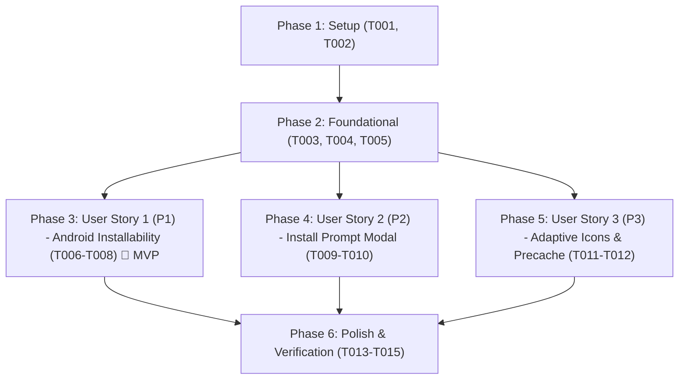

# Tasks: Correção da Instalação do PWA em Dispositivos Android

**Feature**: `006-fix-pwa-android-install`  
**Input**: Design documents from `specs/006-fix-pwa-android-install/` (`spec.md`, `plan.md`, `research.md`, `quickstart.md`)  
**Status**: Ready for Implementation  

---

## Phase 1: Setup (Shared Infrastructure)

**Purpose**: Tooling and test harness setup for PWA asset generation and manifest verification

- [X] T001 Inspect source vector icon `client/public/icons/icon.svg` and create rasterization script in `scripts/generate-pwa-icons.ts`
- [X] T002 [P] Create automated test scaffold for PWA manifest and icon validation in `tests/client/pwa-manifest.test.ts`

---

## Phase 2: Foundational (Blocking Prerequisites)

**Purpose**: High-resolution icon asset generation and base manifest configuration that MUST be complete before user stories can be verified

**⚠️ CRITICAL**: WebAPK minting fails if icon files do not have valid pixel dimensions (192x192 and 512x512)

- [X] T003 Generate valid 192x192 PNG icon `client/public/icons/icon-192x192.png` with real pixel dimensions from `client/public/icons/icon.svg`
- [X] T004 [P] Generate valid 512x512 PNG icon `client/public/icons/icon-512x512.png` and maskable adaptive icon `client/public/icons/icon-maskable-512x512.png` with safe zone padding from `client/public/icons/icon.svg`
- [X] T005 Update PWA manifest configuration in `client/vite.config.ts` with `id: '/'`, `lang: 'pt-BR'`, `scope: '/'`, `start_url: '/'`, standard icons and maskable icon entry

**Checkpoint**: Foundational assets and manifest ready - user stories can now proceed

---

## Phase 3: User Story 1 - Instalação Confiável do Aplicativo em Dispositivos Android (Priority: P1) 🎯 MVP

**Goal**: Permitir que usuários em navegadores Android instalem o Minhas Horas sem o erro "Não é possível instalar o app", abrindo em modo standalone.

**Independent Test**: Inspecionar o manifesto e os arquivos PNG gerados no build de produção, garantindo que o WebAPK validator do Android e Lighthouse PWA aprovem 100% dos requisitos de instalação.

### Tests for User Story 1 ⚠️

- [X] T006 [P] [US1] Write automated tests validating manifest JSON fields (`id`, `start_url`, `display: standalone`, `theme_color`, `icons`), icon HTTP availability, and real image dimensions in `tests/client/pwa-manifest.test.ts`

### Implementation for User Story 1

- [X] T007 [US1] Update `client/index.html` with explicit `<link rel="manifest" href="/manifest.webmanifest">`, `<link rel="apple-touch-icon" href="/icons/icon-192x192.png">`, and mobile web app meta tags
- [X] T008 [US1] Build production client with `npm run build` and verify that `dist/client/manifest.webmanifest` and real icon files are correctly emitted and served

**Checkpoint**: At this point, User Story 1 is functional and Android WebAPK generation requirements are met (MVP achieved).

---

## Phase 4: User Story 2 - Banner e Gatilho Contextual de Instalação no PWA (Priority: P2)

**Goal**: Exibir banner ergonômico com botão "Instalar" antes da instalação e ocultar automaticamente quando executado em modo standalone.

**Independent Test**: Verificar se o evento `beforeinstallprompt` é capturado pelo componente, o botão "Instalar" dispara o diálogo do navegador e a interface oculta o banner após conclusão ou recusa.

### Tests for User Story 2 ⚠️

- [X] T009 [P] [US2] Write unit tests for `InstallPromptModal.vue` verifying `beforeinstallprompt` event binding, prompt trigger, standalone mode detection, and dismissal in `tests/client/install-prompt.test.ts`

### Implementation for User Story 2

- [X] T010 [US2] Refactor `client/src/components/layout/InstallPromptModal.vue` to ensure robust handling of `beforeinstallprompt`, clean dismiss behavior, touch target >= 44x44px, and standalone suppression

**Checkpoint**: User Stories 1 and 2 are functional; the app is installable and guides users contextually.

---

## Phase 5: User Story 3 - Conformidade de Ativos Visuais e Ícones Adaptativos (Priority: P3)

**Goal**: Garantir suporte a ícones adaptativos maskable no Android e suporte complementar para iOS Safari sem cortes visuais.

**Independent Test**: Verificar que o ícone maskable possui camada de fundo com safe zone e que a tag `apple-touch-icon` é carregada no cabeçalho HTML.

### Tests for User Story 3 ⚠️

- [X] T011 [P] [US3] Add automated verification in `tests/client/pwa-manifest.test.ts` for maskable icon declaration (`purpose: "maskable"`) and apple-touch-icon link presence in `client/index.html`

### Implementation for User Story 3

- [X] T012 [US3] Ensure `client/vite.config.ts` workbox precaching includes all icon assets (`icons/*.png`, `icons/*.svg`, `favicon.ico`) for instant offline splash screen loading

**Checkpoint**: All user stories (US1 through US3) are completed and cross-platform compliant.

---

## Phase 6: Polish & Cross-Cutting Concerns

**Purpose**: Documentation, end-to-end verification, and regression testing

- [X] T013 [P] Update `README.md` with PWA installation instructions for Android (Chrome/Samsung Internet) and iOS (Safari)
- [X] T014 Execute quickstart validation scenarios defined in `specs/006-fix-pwa-android-install/quickstart.md`
- [X] T015 Run complete test suite via `npm run test` and verify 0 regressions across all existing tests

---

## Dependencies & Execution Order

### Phase Dependencies

### User Story Dependencies

- **User Story 1 (P1)**: Can start immediately after Foundational Phase 2 completes. No dependencies on other stories.
- **User Story 2 (P2)**: Can start after Foundational Phase 2 completes. Enhances user experience with install banner.
- **User Story 3 (P3)**: Can start after Foundational Phase 2 completes. Validates adaptive visual presentation.

---

## Parallel Opportunities

- **Setup & Foundational**:
  - T002 (Test scaffold) can run in parallel with T001 (Script setup)
  - T004 (512x512 and maskable icons) can run in parallel with T003 (192x192 icon)
- **User Story 1**:
  - T006 (Tests) can run in parallel with T007 (HTML updates)
- **User Story 2**:
  - T009 (Unit tests) can run in parallel with T010 (Component refactor)
- **User Story 3**:
  - T011 (Verification test) can run in parallel with T012 (Vite precache config)
- **Polish**:
  - T013 (README) can run in parallel with validation

---

## Implementation Strategy

### MVP First (User Story 1 Only)
1. Complete Phase 1: Setup (script and test scaffold)
2. Complete Phase 2: Foundational (generate real 192x192 and 512x512 PNGs, configure manifest)
3. Complete Phase 3: User Story 1 (HTML links, test validation, build)
4. **VALIDATE MVP**: Verify that manifest and icons satisfy Android WebAPK criteria.

### Incremental Delivery
1. Add User Story 2: Prompt modal and installation triggers
2. Add User Story 3: Maskable icons and offline precaching
3. Complete Polish: Full regression test suite and documentation
