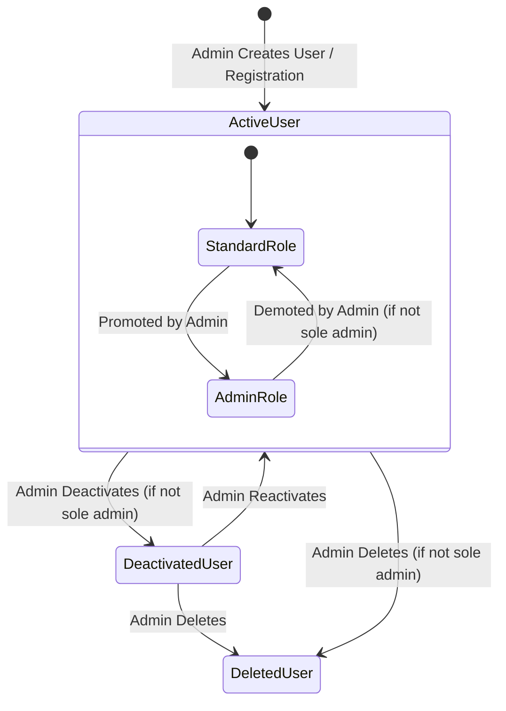

# Data Model: Administrator Role & Management Portal

## Entities & Database Schemas

### 1. User (Modified)
Represents a user account in the system with role-based access control and activation state.

- **Table**: `users`
- **Fields**:
  - `id` (TEXT, PK): UUIDv4
  - `username` (TEXT, UNIQUE, NOT NULL): Lowercase alphanumeric handle
  - `email` (TEXT, UNIQUE, NOT NULL): Normalized user email
  - `password_hash` (TEXT, NOT NULL): Argon2id or scrypt hash
  - `display_name` (TEXT, NOT NULL): User's human-readable name
  - `role` (TEXT, NOT NULL, DEFAULT `'user'`): User role (`'admin'` | `'user'`) *(New)*
  - `is_active` (INTEGER, NOT NULL, DEFAULT `1`): Account status (`1` = active, `0` = deactivated) *(New)*
  - `created_at` (TEXT, NOT NULL): ISO 8601 UTC timestamp
  - `updated_at` (TEXT, NOT NULL): ISO 8601 UTC timestamp

- **Validation Rules**:
  - `role` must be one of `['admin', 'user']`.
  - `is_active` must be either `0` or `1`.
  - At least one active user with `role = 'admin'` must exist in the database at all times.
  - When `is_active` is changed to `0`, all active sessions for this user must be terminated.

---

### 2. UserSession (Modified)
Represents an authenticated bearer session.

- **Table**: `user_sessions`
- **Fields**:
  - `id` (TEXT, PK): UUIDv4
  - `user_id` (TEXT, FK -> users.id ON DELETE CASCADE, NOT NULL)
  - `token` (TEXT, UNIQUE, NOT NULL): Secure session bearer token
  - `user_agent` (TEXT, NULLABLE): Client browser/platform user-agent header
  - `ip_address` (TEXT, NULLABLE): Client remote IP address
  - `expires_at` (TEXT, NOT NULL): ISO 8601 UTC timestamp
  - `created_at` (TEXT, NOT NULL): ISO 8601 UTC timestamp
  - `last_used_at` (TEXT, NOT NULL): ISO 8601 UTC timestamp

- **Validation Rules**:
  - Revoking a session deletes the record from `user_sessions` or marks it expired.
  - Revocation triggers an audit log entry.

---

### 3. AccessAuditLog (New)
Captures security, authentication, and administrative actions for accountability and auditing.

- **Table**: `access_audit_logs`
- **Fields**:
  - `id` (TEXT, PK): UUIDv4
  - `user_id` (TEXT, FK -> users.id ON DELETE SET NULL, NULLABLE): Actor or target user
  - `event_type` (TEXT, NOT NULL):
    - `'login_success'`: Successful user authentication
    - `'login_failed'`: Failed login attempt (invalid credentials)
    - `'logout'`: User sign out
    - `'session_revoked'`: Session terminated by administrator
    - `'user_created'`: New user created by administrator
    - `'user_updated'`: User profile/role modified by administrator
    - `'user_deactivated'`: Account deactivated
    - `'user_activated'`: Account reactivated
    - `'user_deleted'`: Account removed
    - `'password_reset'`: Password changed/reset
  - `ip_address` (TEXT, NULLABLE): Client IP address
  - `user_agent` (TEXT, NULLABLE): Client User-Agent string
  - `details` (TEXT, NULLABLE): JSON string or descriptive text with context (e.g. `{"target_username": "maria", "changed_role": "admin"}`)
  - `created_at` (TEXT, NOT NULL): ISO 8601 UTC timestamp

- **Indices**:
  - `idx_audit_created_at ON access_audit_logs(created_at DESC)`
  - `idx_audit_user_id ON access_audit_logs(user_id)`
  - `idx_audit_event_type ON access_audit_logs(event_type)`

---

## Data Transfer Objects (DTOs)

### 1. AdminUserDto
```typescript
export interface AdminUserDto {
  id: string;
  username: string;
  email: string;
  display_name: string;
  role: 'admin' | 'user';
  is_active: boolean;
  created_at: string;
  updated_at: string;
  active_sessions_count: number;
}
```

### 2. CreateUserRequest
```typescript
export interface CreateUserRequest {
  username: string;
  email: string;
  display_name: string;
  password: string;
  role?: 'admin' | 'user'; // default: 'user'
}
```

### 3. UpdateUserRequest
```typescript
export interface UpdateUserRequest {
  display_name?: string;
  email?: string;
  role?: 'admin' | 'user';
  is_active?: boolean;
}
```

### 4. ResetPasswordRequest
```typescript
export interface ResetPasswordRequest {
  new_password: string;
}
```

### 5. AccessAuditLogDto
```typescript
export interface AccessAuditLogDto {
  id: string;
  user_id: string | null;
  username: string | null;
  display_name: string | null;
  event_type: string;
  ip_address: string | null;
  user_agent: string | null;
  details: string | null;
  created_at: string;
}
```

### 6. AdminActiveSessionDto
```typescript
export interface AdminActiveSessionDto {
  id: string;
  user_id: string;
  username: string;
  display_name: string;
  ip_address: string | null;
  user_agent: string | null;
  created_at: string;
  last_used_at: string;
  expires_at: string;
  is_current_session: boolean;
}
```

### 7. SystemUsageMetricsDto
```typescript
export interface SystemUsageMetricsDto {
  summary: {
    total_users: number;
    active_users: number;
    total_overtime_minutes: number;
    total_compensation_minutes: number;
    net_balance_minutes: number;
    total_entries_count: number;
  };
  users: Array<{
    user_id: string;
    username: string;
    display_name: string;
    role: 'admin' | 'user';
    is_active: boolean;
    overtime_minutes: number;
    compensation_minutes: number;
    net_balance_minutes: number;
    entries_count: number;
    last_entry_date: string | null;
  }>;
}
```

---

## State Transitions & Invariants



### Integrity Invariants
1. `sole_admin_guard`: `COUNT(users WHERE role = 'admin' AND is_active = 1) >= 1` must evaluate to true after any user deletion, deactivation, or role update.
2. `session_cleanup_on_deactivation`: When `is_active` transitions from `1` to `0`, all sessions for `user_id` are immediately purged from `user_sessions`.
