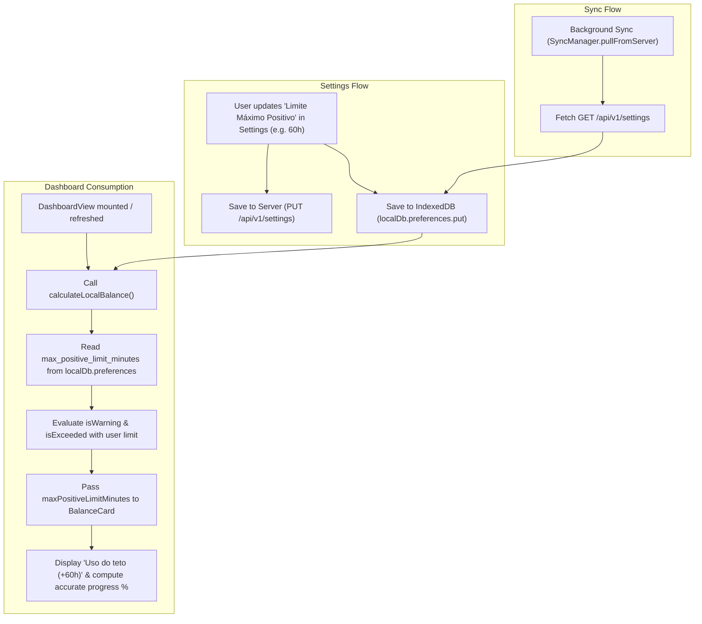

# Phase 1 Data Model: Dynamic Positive Limit Ceiling

## Entities and Schema Definitions

### 1. LocalUserPreferences (Client-Side / IndexedDB)

Represents user preferences and localized operational limits stored in Dexie table `localDb.preferences`.

| Field | Type | Description | Default / Constraints |
|---|---|---|---|
| `user_id` | `string` (PK) | Unique identifier of the authenticated user | Mandatory |
| `theme_mode` | `'light' \| 'dark' \| 'system'` | User UI theme preference | `'system'` |
| `max_positive_limit_minutes` | `number` | Upper ceiling limit for positive banked overtime | Default: `2400` (> 0) |
| `max_negative_limit_minutes` | `number` | Lower threshold for negative deficit hours | Default: `-600` (< 0) |
| `warning_threshold_percentage`| `number` | Percentage threshold for warning banners | Default: `80` (1..100) |
| `daily_standard_work_minutes` | `number` | Expected daily standard work duration | Default: `480` |
| `updated_at` | `string` | ISO 8601 timestamp of last setting change | Current timestamp |

### 2. TimeBankSettingsEntity (Server-Side / SQLite)

Persists server-side balance settings in table `time_bank_settings`.

```sql
CREATE TABLE IF NOT EXISTS time_bank_settings (
  id TEXT PRIMARY KEY,
  user_id TEXT NOT NULL UNIQUE,
  max_positive_limit_minutes INTEGER NOT NULL DEFAULT 2400,
  max_negative_limit_minutes INTEGER NOT NULL DEFAULT -600,
  warning_threshold_percentage REAL NOT NULL DEFAULT 80,
  daily_standard_work_minutes INTEGER NOT NULL DEFAULT 480,
  notifications_enabled INTEGER NOT NULL DEFAULT 1,
  daily_reminder_time TEXT DEFAULT '18:00',
  updated_at TEXT NOT NULL
);
```

### 3. LocalBalanceSummary (DTO / Client State)

Output of `calculateLocalBalance()` consumed by `DashboardView.vue`, `BalanceCard.vue`, and `LimitAlertBanner.vue`.

```typescript
export interface LocalBalanceSummary {
  totalPositiveMinutes: number;
  totalNegativeMinutes: number;
  netBalanceMinutes: number;
  projectedBalanceMinutes: number;
  isWarning: boolean;
  isExceeded: boolean;
  maxPositiveLimitMinutes: number;    // Bound to user-configured limit
  maxNegativeLimitMinutes: number;    // Bound to user-configured limit
  warningThresholdPercentage: number; // Bound to user-configured warning percentage
}
```

## State Transitions & Data Flow


